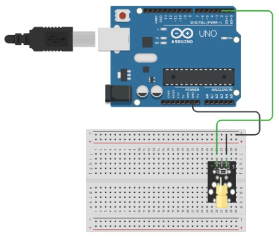

# Arduino and a Laser

A basic example of controlling a laser using an Arduino.

## Arduino Code

Open up [Arduino Create](https://create.arduino.cc/editor/) and add the following code:

```csharp
int laserPin = 2;

void setup() {

	pinMode(laserPin, OUTPUT);

}

void loop() {

	digitalWrite(laserPin, HIGH);
	delay(1000);

	digitalWrite(laserPin, LOW);
	delay(1000);

}
```

> [View the Arduino code on Arduino Create](https://create.arduino.cc/editor/professoradam/bd120ce7-2329-44db-a472-d7aa5f767a20/preview)

You will need to setup the following circuit using your Arduino:



> [View the Circuit on Tinkercad](https://www.tinkercad.com/things/4gRQcWldkm2-arduino-laser)

> Full tutorial URL:  
> https://codeadam.ca/learning/arduino-laser.html

---

## Repo Resources

- [Visual Studio Code](https://code.visualstudio.com/) or [Brackets](http://brackets.io/) (or any code editor)
- [Arduino Create](https://create.arduino.cc/editor)

<br>
<a href="https://codeadam.ca">

</a>
